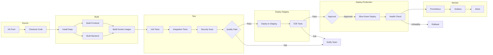

# Exercise 1: CI/CD Pipeline Design (Pair Programming)

## Objective

Design a comprehensive CI/CD pipeline for a web application, documenting each stage, the tools involved, and deployment strategies. This is a **conceptual/design exercise** focusing on DevOps thinking.

---

## Learning Outcomes

By completing this exercise, you will:
- Apply DevOps principles to pipeline design
- Understand the stages of a CI/CD pipeline
- Select appropriate tools for each stage
- Design deployment strategies
- Document technical decisions
- Collaborate effectively in a pair programming setting

---

## Prerequisites

- Read DevOps Introduction content
- Read CI/CD content
- Partner for pair programming

---

## Time Estimate

45 minutes (Pair Programming)

---

## Pair Programming Roles

- **Driver:** Creates diagrams, writes documentation
- **Navigator:** Guides design decisions, checks against requirements

**Switch roles at 20-minute mark!**

---

## The Scenario

You're designing a CI/CD pipeline for **ShopFlow**, a fictional e-commerce platform:

**Application Stack:**
- Frontend: React SPA
- Backend: Python Flask API
- Database: PostgreSQL
- Cache: Redis

**Requirements:**
- Multiple developers pushing daily
- Staging environment for QA
- Production with zero-downtime deployments
- Automated testing at multiple levels
- Security scanning
- Monitoring integration

---

## Tasks

### Task 1: Define Pipeline Stages (15 minutes)

Using the template below, design your pipeline stages.

1. **Create Design Document**
   
   Create a file `pipeline-design.md`:

   ```markdown
   # ShopFlow CI/CD Pipeline Design
   
   ## Team Information
   - Designer 1: [Name]
   - Designer 2: [Name]
   - Date: [Date]
   
   ## Pipeline Overview
   
   [Describe the high-level flow]
   
   ## Stage 1: Source
   
   **Trigger:** [What starts the pipeline?]
   **Actions:**
   - [ ] Code checkout
   - [ ] Dependency caching
   
   **Tools:** [List tools]
   
   ## Stage 2: Build
   
   **Actions:**
   - [ ] Compile/bundle frontend
   - [ ] Build Docker images
   - [ ] Generate artifacts
   
   **Tools:** [List tools]
   
   **Artifacts Produced:**
   - [ ] List artifacts
   
   ## Stage 3: Test
   
   **Unit Tests:**
   - Frontend: [Tool and approach]
   - Backend: [Tool and approach]
   
   **Integration Tests:**
   - [Describe approach]
   
   **Security Scans:**
   - [ ] SAST (Static Analysis)
   - [ ] Dependency scanning
   
   **Quality Gates:**
   - [ ] Code coverage minimum: ___%
   - [ ] No critical vulnerabilities
   
   **Tools:** [List tools]
   
   ## Stage 4: Deploy to Staging
   
   **Environment:** [Describe staging]
   **Deployment Method:** [How?]
   **Automatic:** Yes/No
   
   ## Stage 5: Acceptance Testing
   
   **Tests:**
   - [ ] E2E tests
   - [ ] Performance tests
   - [ ] Manual QA (if any)
   
   **Tools:** [List tools]
   
   ## Stage 6: Deploy to Production
   
   **Strategy:** [Blue-Green / Canary / Rolling]
   **Approval:** Manual / Automatic
   **Rollback Plan:** [Describe]
   
   ## Stage 7: Monitor
   
   **Metrics Collected:**
   - [ ] Application metrics
   - [ ] Infrastructure metrics
   
   **Alerting:**
   - [ ] Error rate threshold
   - [ ] Latency threshold
   
   **Tools:** [List tools]
   ```

2. **Discussion Points While Designing:**
   - What happens if a stage fails?
   - How long should each stage take?
   - What notifications are sent?
   - Who approves production deployments?

**Checkpoint:** Pipeline stages documented ✓

---

### Task 2: Create Pipeline Diagram (15 minutes)

**Switch roles if you haven't!**

Create a visual diagram using Mermaid syntax:

```markdown
## Pipeline Diagram


```

---

### Task 3: Deployment Strategy Deep Dive (10 minutes)

Choose and document your deployment strategy:

```markdown
## Deployment Strategy: Blue-Green

### How It Works

1. **Blue Environment:** Current production (serving traffic)
2. **Green Environment:** New version deployed and tested
3. **Switch:** Update load balancer to point to Green
4. **Rollback:** Switch back to Blue if issues detected

### Diagram

```
                 Load Balancer
                      │
         ┌───────────┴───────────┐
         │                       │
         ▼                       ▼
   ┌───────────┐           ┌───────────┐
   │   Blue    │           │   Green   │
   │  (v1.0)   │           │  (v1.1)   │
   │  ACTIVE   │           │  STANDBY  │
   └───────────┘           └───────────┘
```

### Pros
- Zero downtime
- Easy rollback
- Full testing before switch

### Cons
- Double infrastructure cost
- Database migrations tricky

### Alternative Considered: Canary

[Explain why you chose Blue-Green over Canary or vice versa]
```

---

### Task 4: Define Quality Gates (5 minutes)

```markdown
## Quality Gates

### Gate 1: Build Stage
- [ ] All dependencies resolved
- [ ] Docker images built successfully
- [ ] Build time < 10 minutes

### Gate 2: Test Stage
- [ ] Unit test coverage ≥ 80%
- [ ] All unit tests pass
- [ ] No critical security vulnerabilities
- [ ] No high-severity code smells

### Gate 3: Staging
- [ ] E2E tests pass
- [ ] Performance within SLA (p95 < 500ms)
- [ ] No error rate increase

### Gate 4: Production
- [ ] Health checks pass
- [ ] Error rate < 1%
- [ ] Latency within baseline

### Failure Actions

| Gate | Failure Action |
|------|----------------|
| Build | Block, notify developer |
| Test | Block, notify team |
| Staging | Block, notify QA lead |
| Production | Rollback, page on-call |
```

---

## Verification Checklist

- [ ] Complete pipeline design document
- [ ] Visual pipeline diagram created
- [ ] Deployment strategy documented with rationale
- [ ] Quality gates defined
- [ ] All seven stages addressed
- [ ] Partner contributed equally (role switches)

---

## Deliverables

1. `pipeline-design.md` - Complete design document
2. Mermaid diagram embedded in document
3. Brief reflection (3-4 sentences): What was the hardest decision? How did pair programming help?

---

## Design Considerations

### Questions to Discuss

1. **Speed vs Safety:** How do you balance fast deployments with thorough testing?
2. **Automation vs Control:** What should be automated vs. require human approval?
3. **Cost vs Reliability:** How much infrastructure redundancy is worth it?
4. **Simplicity vs Completeness:** Is every stage necessary for your team size?

### Common Pitfalls

- **Over-engineering:** Don't design for Google-scale if you're a 5-person team
- **Under-testing:** Skipping stages to deploy faster backfires
- **No rollback plan:** Always have a way back
- **Ignoring monitoring:** Deploying is half the battle; knowing it works is the other half

---

## Example Tool Selection

| Stage | Tool Options |
|-------|--------------|
| Source | GitHub, GitLab, Bitbucket |
| Build | Jenkins, GitHub Actions, GitLab CI |
| Test - Unit | Jest (JS), Pytest (Python), JUnit (Java) |
| Test - E2E | Selenium, Cypress, Playwright |
| Test - Security | SonarQube, Snyk, Trivy |
| Registry | Docker Hub, ECR, GCR |
| Deploy | Jenkins, ArgoCD, Spinnaker |
| Infrastructure | Terraform, CloudFormation, Pulumi |
| Monitoring | Prometheus + Grafana, Datadog |
| Alerting | PagerDuty, Opsgenie, Slack |

---

## Clean-Up

No technical clean-up needed—this is a design exercise.

Save your design document for future reference and Jenkins exercises tomorrow!

---

## Additional Resources

- [DevOps Roadmap](https://roadmap.sh/devops)
- [CI/CD Best Practices](https://www.atlassian.com/continuous-delivery/principles/continuous-integration-vs-delivery-vs-deployment)
- [Deployment Strategies Explained](https://www.redhat.com/en/topics/devops/what-is-blue-green-deployment)

